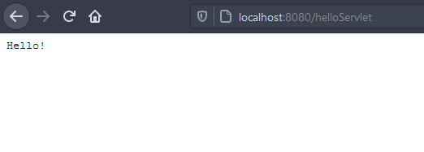
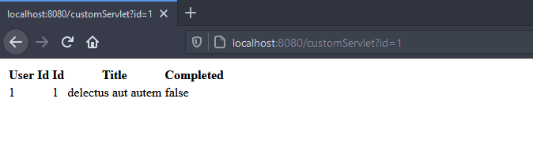
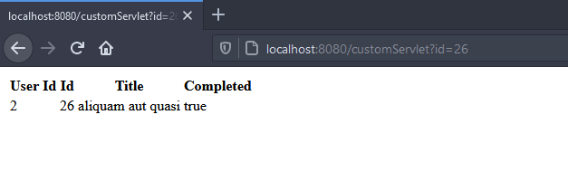
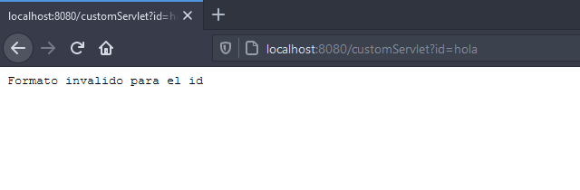
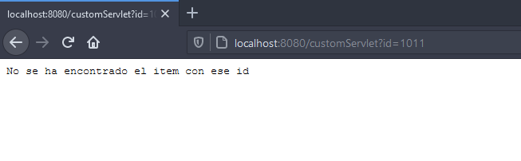
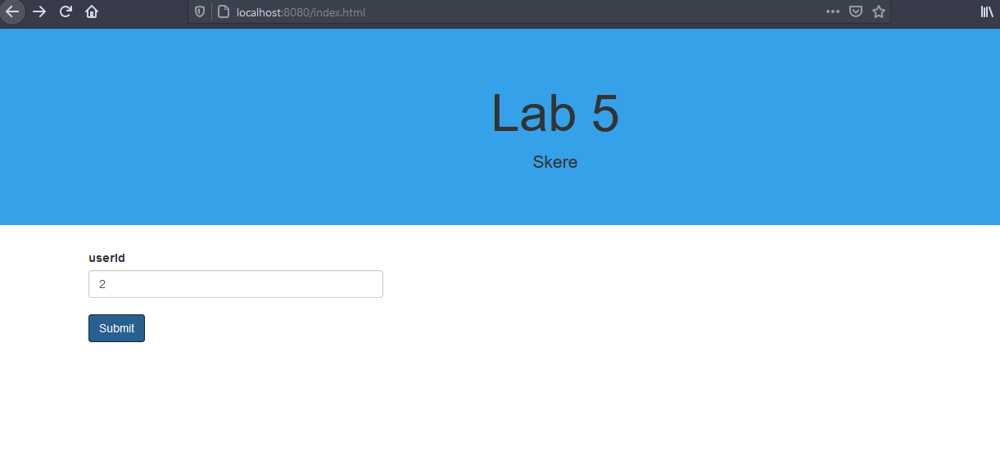
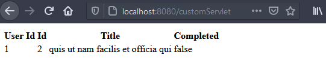
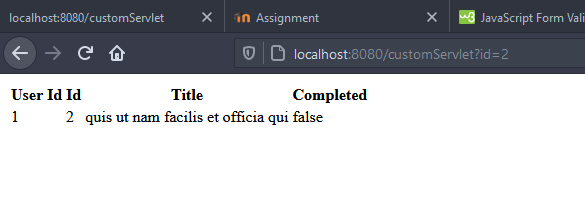

# Lab5

## Parte 1 

1. Realice una cinexión sincrona TCP/IP a través de Telnet al siguiente servidor
    

2. Petición GET a telnet www.escuelaing.edu.co 80
      

    301 Moved Permanently: Indica que el host ha sido capaz de comunicarse con el servidor pero el recurso que solicitamos fue movido permanentemente   

    ¿Qué otros código de error existen?, ¿En qué caso se manejarán?

        
3. Realice una nueva conexión con telnet, esta vez a
    

    Se obtiene un archivo html con texto 

4. Contar numero de letras del resultado

      
    

    ¿Cual es la diferencia entre el verbo GET y POST?

    

    ¿Que tipo de peticiones existen?

    
5. Curl 
    * Curl sin parametros

        
    * Curl con parametro -v 
        
    * Curl con parametros -i 
        

    * ¿Cual es la diferencia entre los parametros?
        1. Parametro i: Incluye el protocolo responsable en el output 
        2. Parametro v: Retorna el output con mas información 

## Parte 2 

1. Puerto TCP/IP de Tomcat 

    

    1. mvn package

        
    
    2. mvn tomcat7:run

        

2. Abra un navegador y ponga la dirección con la cual se le enviarán las peticiones al SampleServer

    

3. Utilice el metodo GET para ingresar el valor del parametro name

    

4. revise la direccion https://jsonplaceholder.typicode.com/todos/1. Intente cambiando diferentes números al final del path

    * Numero 1
        
    * Numero 30 
        
    * Numero 55
        
5. Implementación de la nueva clase CustomServlet.java
    * id 1
        
    * id 26
        
    * NumberFormatException 
        
    * FileNotFoundException
        
    
## Parte 3
1. Index.html
    
2. Post
    
3. Get
    

La diferencia es que si utilizamos el metodo get lo que hace es poner ?id=2
es decir, como enviarle el parametro id
